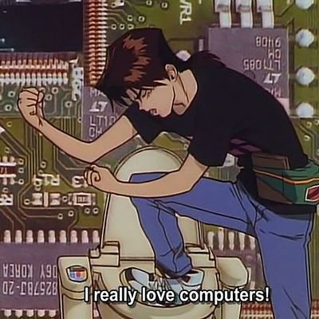

# "My name is Gustavo, but you can call me Gus!"

    

## About me
- I have been working as a software engineer since 2022.  
- I started programming in 2016 with electronics and embedded software for microcontrollers like the ATmega328P and PIC.
- Electronics technician and enthusiast
- I use Arch, btw.  

## My Tech Stack  

  
[

